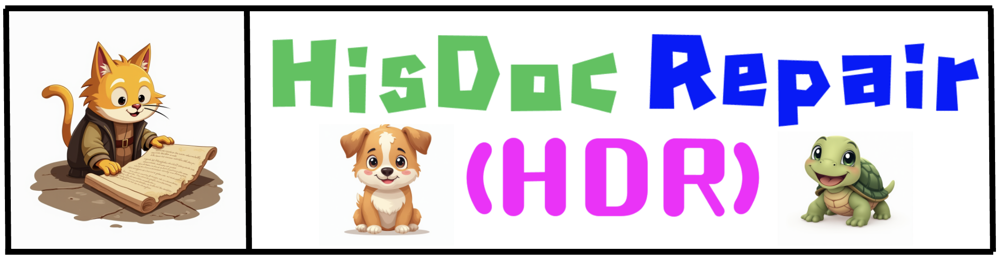
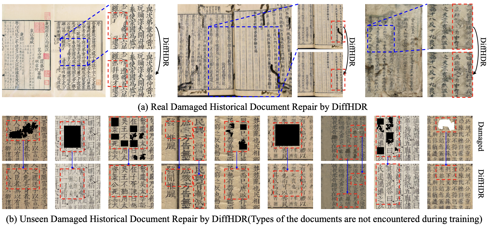
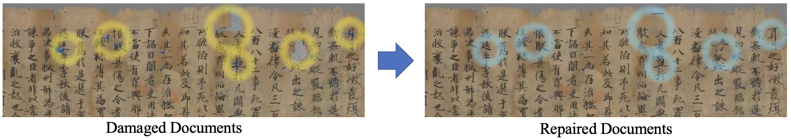
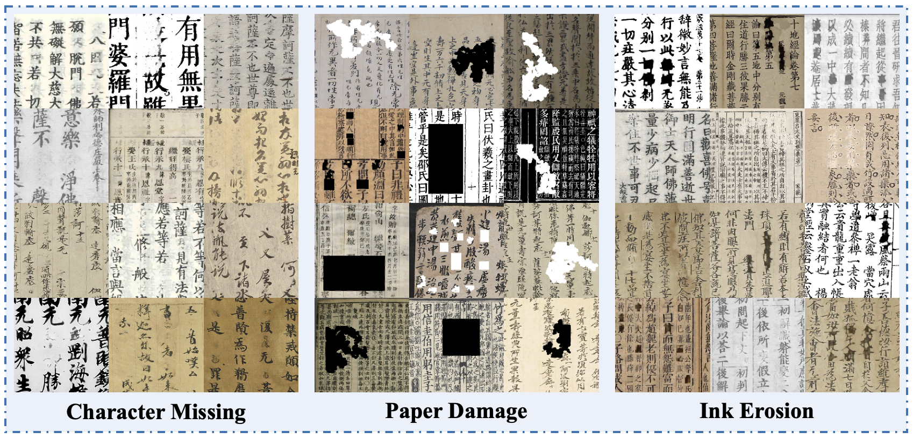

<div align=center>

# Predicting the Original Appearance of Damaged Historical Documents

</div>

  

<div align=center>

[](https://arxiv.org/abs/2312.12142) 
[](https://yeungchenwa.github.io/fontdiffuser-homepage/)
[](https://github.com/yeungchenwa/HDR)

</div>

<p align="center">
   <strong><a href="#🖼️-Gallery">🖼️ Gallery </a></strong> •
   <strong><a href="#📊-HDR28K">📊 HDR28K </a></strong> •
   <strong><a href="#🔥-Model-Zoo">🔥 Model Zoo</a></strong> •
   <strong><a href="#🔥-Dataset-Zoo">🔥 Dataset Zoo</a></strong> •
   <strong><a href="#🚧-Installation">🚧 Installation</a></strong> •
   <strong><a href="#📺-Inference">📺 Inference</a></strong> •
   <strong><a href="#📏-Evaluation">📏 Evaluation</a></strong>
</p>

## 🌟 Highlight


+ We introduce a <u>H</u>istorical <u>D</u>ocument <u>R</u>epair **(HDR)** task,
which endeavors to predict the original appearance of
damaged historical document images.
+ We build a large-scale historical document repair dataset,
termed **HDR28K**, which includes <u>28,552</u> damaged-repaired image pairs with **character-level annotations** and **multi-style degradation**.
+ 🔥🔥🔥 We propose a <u>Diff</u>usion-based <u>H</u>istorical <u>D</u>ocument <u>R</u>epair method **(DiffHDR)**, which augments the DDPM framework with semantic and spatial information

## 📰 News
- **2025.03.20**: 🎉🎉 The Historical Document Repair dataset [HDR28K]() is released!
- **2024.12.17**: Release inference code.   
- **2024.12.10**: 🎉🎉 Our [paper](https://arxiv.org/abs/2412.11634) is accepted by AAAI2025.   

## 🏗️ TODO List
- [x] Inference Code.
- [x] HDR28K Dataset Release.

## 🔥 Model Zoo
| **Model**                                    | **chekcpoint** | **status** |
|----------------------------------------------|----------------|------------|
| **DiffHDR**                              | [GoogleDrive](https://drive.google.com/drive/folders/1ArP21T7vyTpbPb5qC5VV76pMUsQd4tCx?usp=sharing) / [BaiduYun:x62f](https://pan.baidu.com/s/1XpoGvQHruOQjzJDEymsXzg) | Released  |

## 🔥 Dataset Zoo
| **Model**                                    | **chekcpoint** | **status** |
|----------------------------------------------|----------------|------------|
| **HDR28K**                              | [BaiduYun:x62f](https://pan.baidu.com/s/1XpoGvQHruOQjzJDEymsXzg) | Released  |

The dataset file structure is as followed:
```bash
- character_missing
  - test
    - char_mask_images
    - content_images
    - degraded_images
    - original_images
  - train
    - char_mask_images
    - content_images
    - degraded_images
    - original_images
- ink erosion
  - similar to 'character_missing'
- paper damage
  - similar to 'character_missing'
- test_image_only_damage
  - hole_M5_image_2000_32_467_544_979_degrade0.png
  - ......
```
**NOTE**: The `test_image_only_damage` contains the gt image after replacing the non-damaged region of $x_r$ by the target $x_{target}$.

## 🚧 Installation
### Prerequisites (Recommended)
- Linux
- Python 3.9
- Pytorch 1.13.1
- CUDA 11.7

### Environment Setup
Clone this repo:
```bash
git clone https://github.com/yeungchenwa/HDR.git
```

**Step 0**: Download and install Miniconda from the [official website](https://docs.conda.io/en/latest/miniconda.html).

**Step 1**: Create a conda environment and activate it.
```bash
conda create -n diffhdr python=3.9 -y
conda activate diffhdr
```

**Step 2**: Install related version Pytorch following [here](https://pytorch.org/get-started/previous-versions/).
```bash
# Suggested
pip install torch==1.13.1+cu117 torchvision==0.14.1+cu117 torchaudio==0.13.1 --extra-index-url https://download.pytorch.org/whl/cu117
```

**Step 3**: Install the required packages.
```bash
pip install -r requirements.txt
```

## 📺 Inference
Using DiffHDR for damaged historical documents repair (Some examples including damaged images, mask images, and content images are provided in `/examples`):
```bash
sh scripts/inference.sh
```
- `device`: CUDA or CPU used for inference,
- `image_path`: The damaged image path.
- `mask_image_path`: The masked image path.
- `content_image_path`: The content image path.
- `save_dir`: The directory for saving repaired image.
- `content_mask_guidance_scale`: The guidance scale of content image and masked image.
- `degraded_guidance_scale`: The guidance scale of damaged image.
- `ckpt_path`: The unet checkpoint path.
- `num_inference_steps`: The number of inference steps.

## 📊 HDR28K


## 📏 Evaluation
```bash
Coming soon ...
```

## 💙 Acknowledgement
- [diffusers](https://github.com/huggingface/diffusers)

## ⛔️ Copyright
- This repository can only be used for non-commercial research purposes.
- For commercial use, please contact Prof. Lianwen Jin (eelwjin@scut.edu.cn).
- Copyright 2024, [Deep Learning and Vision Computing Lab (DLVC-Lab)](http://www.dlvc-lab.net), South China University of Technology. 

## 📇 Citation
```
@inproceedings{yang2024fontdiffuser,
  title={Predicting the Original Appearance of Damaged Historical Documents},
  author={Yang, Zhenhua and Peng, Dezhi and Shi, Yongxin and Zhang, Yuyi and Liu, Chongyu and Jin, Lianwen},
  booktitle={Proceedings of the AAAI conference on artificial intelligence},
  year={2025}
}
```

## 🌟 Star Rising
[](https://star-history.com/#yeungchenwa/HDR&Timeline)
